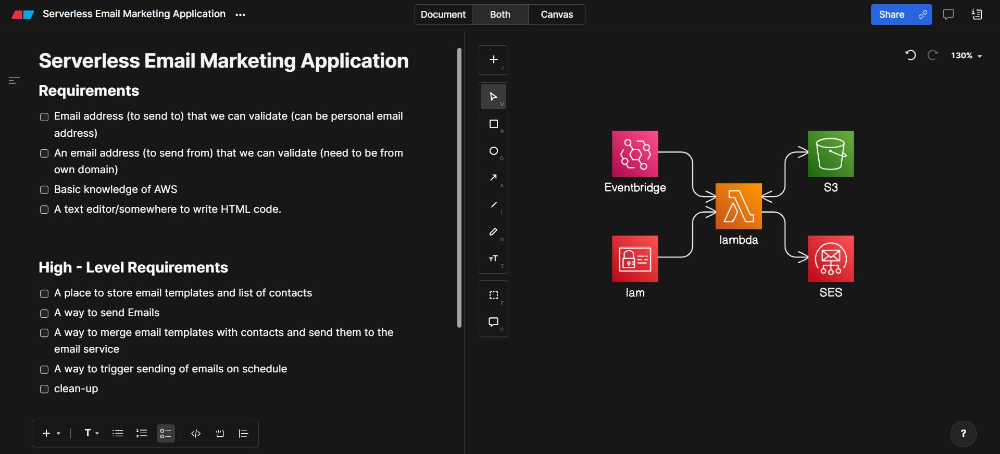

# Serverless Email Marketing Application

This serverless email marketing application leverages AWS cloud services to send personalized emails to a list of contacts. The application uses AWS Lambda, Amazon S3, AWS SES, Amazon EventBridge, and IAM to provide a scalable and cost-effective solution.

## Architecture

## Features

- **Serverless**: Utilizes AWS Lambda for executing code without provisioning servers.
- **Event-Driven**: Uses Amazon EventBridge to trigger Lambda functions based on scheduled events.
- **Storage**: Stores email templates and contact information in Amazon S3.
- **Email Sending**: Sends personalized emails through AWS SES.
- **Secure**: Manages permissions and policies using AWS IAM.

## Prerequisites

- AWS Account
- AWS CLI configured
- Necessary AWS services enabled (Lambda, S3, SES, EventBridge, IAM)

## Setup Instructions

### 1. Plan and Design

- Use Eraser.io or any other tool to plan your architecture and keynotes.

### 2. Create S3 Buckets

- Create an S3 bucket to store the email template and contacts.csv file.

### 3. Upload Files

- Upload your email template (with `{{FirstName}}` placeholder) and `contacts.csv` file to the S3 bucket.
- [Email Template](email_template.html)
- [Contacts CSV](contacts.csv)

### 4. Create Lambda Function

- Create a Lambda function to:
  - Fetch the email template and contacts.csv from the S3 bucket.
  - Replace the `{{FirstName}}` placeholder in the template with data from the CSV file.
  - Send emails using AWS SES.

### 5. Configure IAM Policies

- Create and attach necessary IAM policies to allow the Lambda function to access S3, SES, and other required services.

### 6. Schedule EventBridge Event

- Create an EventBridge rule to schedule the Lambda function invocation at desired intervals.

## AWS Lambda Function Code

Here's the txt file which contains the Lambda and necessary IAM policy for lambda function

- [Lambda_Function](Lambda_Function.txt)

