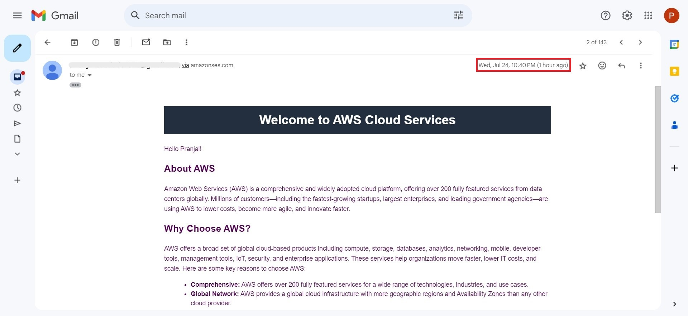

# Serverless Email Marketing Application

This serverless email marketing application leverages AWS cloud services to send personalized emails to a list of contacts. The application uses AWS Lambda, Amazon S3, AWS SES, Amazon EventBridge, and IAM to provide a scalable and cost-effective solution.

## Architecture

## Features

- **Serverless**: Utilizes AWS Lambda for executing code without provisioning servers.
- **Event-Driven**: Uses Amazon EventBridge to trigger Lambda functions based on scheduled events.
- **Storage**: Stores email templates and contact information in Amazon S3.
- **Email Sending**: Sends personalized emails through AWS SES.
- **Secure**: Manages permissions and policies using AWS IAM.

## Prerequisites

- AWS Account
- AWS CLI configured
- Necessary AWS services enabled (Lambda, S3, SES, EventBridge, IAM)

## Setup Instructions

### 1. Plan and Design

- Use https://app.eraser.io/ or any other tool to plan your architecture and keynotes.

### 2. Create S3 Buckets

- Create an S3 bucket to store the email template and contacts.csv file.

### 3. Upload Files

- Upload your email template (with `{{FirstName}}` placeholder) and `contacts.csv` file to the S3 bucket.
- [Email Template](email_template.html)
- [Contacts CSV](contacts.csv)

### 4. Configure Amazon SES

- Verify your sender domain with Amazon SES:
  1. Open the Amazon SES console at [Amazon SES Console](https://console.aws.amazon.com/ses/).
  2. In the navigation pane, under **Identity Management**, choose **Domains**.
  3. Choose **Verify a New Domain**.
  4. In the **Verify a New Domain** dialog box, enter your domain name, and then choose **Verify This Domain**.
  5. Follow the instructions to add the DNS records to your domain's DNS settings to complete the verification process.
  6. Once the domain is verified, you are ready to go!
 
  if you dont have a domain then we need to create identiity and verify it for each email we need to send.

### 5. Create Lambda Function

- Create a Lambda function to:
  - Fetch the email template and contacts.csv from the S3 bucket.
  - Replace the `{{FirstName}}` placeholder in the template with data from the CSV file.
  - Send emails using AWS SES.

Refer to the [Lambda Function Code](Lambda_Function.txt) for the detailed implementation.

### 6. Configure IAM Policies

- Create and attach necessary IAM policies to allow the Lambda function to access S3, SES, and other required services.

### 7. Schedule EventBridge Event

- Create an EventBridge rule to schedule the Lambda function invocation at desired intervals. eg: I have scheduled the event to send mail at 22:40.

## Results

- Check your inbox for the mail and the time

